  
  
  

---

## 🪺 Inside the nest

<b>🐔 About me</b>

 

- 🎓 MSc Data Science at the **University of Hertfordshire**, after a B.Tech in Information Technology (First Class with Distinction)
- 💼 Data Scientist and Full-Stack Developer intern at **10xscale.ai**
- 🌱 Currently learning: **Data Science**
- 💬 Ask me about: **Data Science, marketing strategy, graphic design**
- 🧑🏻‍💻 **11 projects** so far, across web and data science (some repositories are private)
- 📫 Reach me at **danushmathip@gmail.com**
- ⚡ Fun fact: *"The only way to do great work is to love what you do. If you haven't found it yet, keep looking and don't settle."*

---

## 🧺 The egg basket

Click an egg to crack it open.

<!-- Add repo or demo links inside each egg, e.g. [View the project](https://github.com/DANUSHMATHI2002/REPO-NAME) -->

<b>🥚 AquaTox AI: my MSc final project</b>

 

Predicts whether chemicals build up in fish (safe vs dangerous) using QSAR modelling. I compared Logistic Regression, Random Forest and XGBoost on 779 chemicals and 9 molecular descriptors. XGBoost won with an F1 of 0.827. It comes with a full-stack dashboard built on FastAPI, React and Vite, with SHAP explanations and SQLite behind it.

<b>🥚 Customer Churn Prediction Platform</b>

 

A churn prediction platform built with production-style tooling.

**Stack:** Kafka, PySpark, XGBoost, MLflow, SHAP, FastAPI, Airflow, Terraform, AWS

<b>🥚 LeadPulse</b>

 

Lead scoring with a Random Forest, tracked in MLflow and deployed on Hugging Face.

<b>🥚 MetroFlow</b>

 

Demand forecasting with time-series models and K-Means clustering.

<b>🥚 Audio Deepfake Detection</b>

 

A ResNet-18 detector that reaches 92.3% accuracy at 43 FPS.

<b>🥚 Bid.It</b>

 

An auction platform for farmers. Best Project at BitHacks'24, published in IJARIIE, and a patent has been filed for it.

<b>🥚 TechGPT</b>

 

Chat with your CSV files, built with OpenAI and Streamlit.

<b>🥚 Stock Forecasting and Portfolio Optimizer</b>

 

Stock forecasting and portfolio optimisation, with visualised outputs.

<b>🏅 Shiny things</b>

 

- 🏆 Best Project, BitHacks'24
- 📄 Published in IJARIIE
- 📜 Patents filed, including a high-security medical e-prescription system
- 🎓 B.Tech Information Technology, First Class with Distinction

---

## 🐣 Skills

  

Open a nest to see everything inside. Hover an icon for its name.

<b>🐍 Languages</b>

 

  
  
  
  
  
   Also: SQL

<b>🧠 ML and AI</b>

 

  
  
  
  
   Also: XGBoost, MLflow, SHAP

<b>🗄️ Data</b>

 

  
  
  
  
  
  
  
  
  

<b>📊 Viz and BI</b>

 

  
  
  
  
   Also: SHAP explainers

<b>🌐 Web and APIs</b>

 

  
  
  
  
   Also: REST APIs, Hugging Face

<b>☁️ Cloud and IT</b>

 

  
  
  
  
  
  
  
  
  
  

---

## 🐔 Ask the hen

Click a question to see the answer.

<b>🥚 Why should you hire me?</b>

 

Because I hatch the whole idea, not just the first crack. In my projects I go from raw data to a model, an API and a dashboard that someone can actually use. AquaTox AI is a good example: an XGBoost classifier (F1 0.827) behind a FastAPI and React dashboard, with SHAP explanations built in. I have also presented findings to clients during my internship at 10xscale.ai, and I care about explaining technical work in plain language.

<b>🐣 What can I do for your team?</b>

 

- Build and evaluate ML models for classification, forecasting and lead scoring
- Ship them behind APIs and dashboards with FastAPI, React and Streamlit
- Set up production-style pipelines with Kafka, PySpark, Airflow, MLflow, Terraform and AWS
- Explain model decisions with SHAP
- Turn results into something clients and non-technical people can follow

<b>🪺 What is the best example of my work?</b>

 

Two projects sit at the top of the nest.

**AquaTox AI** is my MSc final project. It classifies fish bioconcentration from 779 chemicals and 9 molecular descriptors, and comes with a full-stack dashboard.

**Customer Churn Prediction Platform** is built with Kafka, PySpark, XGBoost, MLflow, SHAP, FastAPI, Airflow, Terraform and AWS, the way a production system would be.

<b>🔍 How do I make sure my results are right?</b>

 

I check every egg before it leaves the nest. While building AquaTox I caught a class distribution chart with its Safe and Dangerous labels swapped, because pandas sorted the counts by frequency instead of by class. It was a one-line fix (`.sort_index()`), but the chart would have told the wrong story. Small bug, big lesson: always check a chart against the raw counts.

<b>🎓 What is my background?</b>

 

- MSc Data Science, University of Hertfordshire
- B.Tech Information Technology, First Class with Distinction
- Data Scientist and Full-Stack Developer intern at 10xscale.ai
- Digital Marketing Analyst at Innfini Homes (remote, summer 2024)
- Best Project at BitHacks'24, published in IJARIIE, patents filed

<b>🐔 What else can I do besides code?</b>

 

I can talk marketing strategy and graphic design, and I have worked customer-facing jobs alongside my studies, so I am comfortable working with people and under pressure.

<b>🌾 What am I looking for next?</b>

 

A data scientist role where I can keep building things end to end.

<b>📬 How do you reach me?</b>

 

Email me at **danushmathip@gmail.com** or message me on [LinkedIn](https://www.linkedin.com/in/danushmathi-p-865b11245/).

🥚 🥚 🐣 🐥 Thanks for stopping by. Crack an egg, meet a chick.

